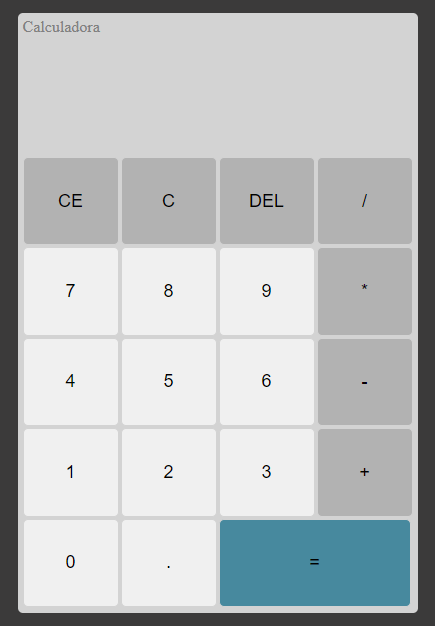
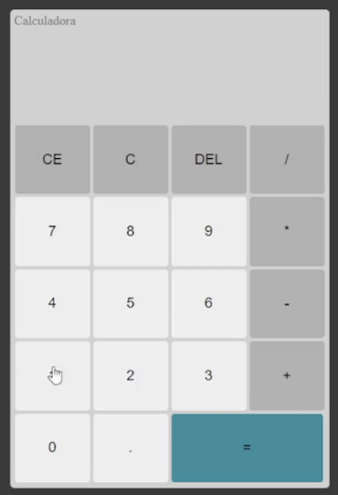

<h1 align="center">Calculadora</h1>

Calculadora de operações básicas com números naturais.

 <a href="#Descrição">Descrição</a> •
 <a href="#Tecnologias">Tecnologias utilizadas</a> •
 <a href="#autor">Autor</a>

---

 

<h1 align="center">  
  

    
    

</h1>

### Descrição

Nesse projeto criei uma calculadora de operações básicas dos <b font-weigth="700">números naturais</b> com a finalidade de exercitar meu aprendizado em <b font-weigth="700">HTML CSS e JavaScript</b>. A inspiração do projeto foi a calculadora do Windows.
O projeto foi criado tendo em vias as boas práticas, utilizando <b font-weigth="700">Flexbox, Grid, POO</b> e também interação através do DOM para capturar os eventos do HTML no JS.

### Tecnologias utilizadas

As seguintes ferramentas foram usadas na construção do projeto:

- 
- 
- 

---

### Autor

Made with 💜 by Renan Cesar 👋

